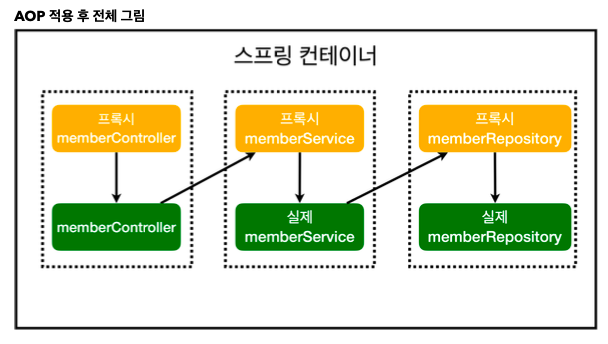

## hellospring
https://www.inflearn.com/course/스프링-입문-스프링부트

* 동시성 문제: 스프링은 싱글톤이 보장되어 인스턴스가 1개씩 존재한다. 다중 쓰레드가 하나뿐인 인스턴스 필드에 접근할 때 동시성 문제가 발생한다.   
* Java 1.8 Opinional: 객체 null pointer error 조치   
* Junit 테스트 케이스는 개별 테스트의 순서를 보장하지 않기 때문에 서로 의존 관계가 없게 설계되어야 한다.   
- 각 테스트 케이스가 끝날 때마다 공용 메모리 등을 비워주어야 한다. (@Transactional 이용)   
* TDD: 테스트 케이스 선 작성 후 테스트 성공일 때, 구현체를 만든다.   
* DI: 생성자 주입 권장 (내가 쓰는 건 필드 주입 방식인데 비권장)   
* DI 생성자 주입 시, 생성자 하나일 경우 @Autowired 생략 가능   
* AOP     

